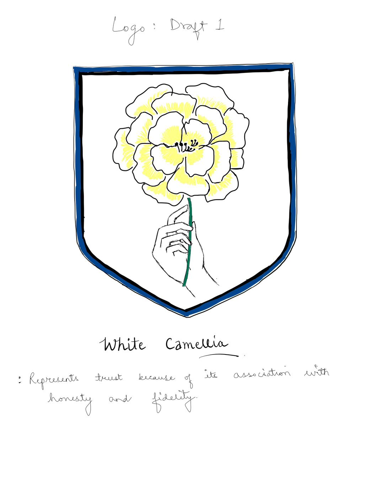

# DECISION LOG 
## Decision Details 
- Date: Sep 25th, 2023
- Decision Maker: Vidhu, All members
  
## Background 
To create a logo that reflects the essence of the project, which is centred around authenticity, trust, and the theme of Australia. A logo should represent the core values and objectives of the project. The project's focus on the credibility and authenticity of images needs to be mirrored in the logo design.

## Decision Options and Rationale

1. Choice of Imagery:

**Decision**: To include a hand holding a flower as the primary image.

**Reasoning**: The hand represents trustworthiness, authenticity, and human touch, while the flower, reminiscent of Australian flora, ties in with the project's theme.

2. Color Palette Decision:

**Decision**: Use soft, natural tones for the flower and neutral shades for the hand.

**Reasoning**: Soft and neutral colours often evoke feelings of trust, reliability, and authenticity. They also resonate with the Australian theme, bringing to mind its natural landscapes.

3. Choice of Flower

**Decision**: White Camellia. 

Reasoning: The White Camellia, although not originally native to Australia, was introduced early on and has since become a popular and cherished addition to many Australian gardens. Symbolizing adoration, perfection, and longevity, its white hue embodies purity, authenticity, and clarity. This aligns with the project's aim to present genuine, authentic images. The selection of the White Camellia emphasizes the platform's commitment to upholding authenticity, mirroring the flower's longstanding presence and appreciation in Australian culture.

4. Shape and Border Design:

**Decision**: A shield-like border with a blue outline.

**Reasoning**: Shields have historically been symbols of protection and defence. Blue is associated with trust and reliability, aligning with the platform's mission. This design choice mirrors the project's aim of protecting the credibility of images.

5. Design Style:

**Decision**: Simplicity of the Design

**Reasoning**: A simplistic design ensures easy recognition and reproduction across various platforms and mediums. It also aligns with the straightforward and transparent nature of the platform's objectives. 

## Follow-up Actions 
Feedback during design iterations was invaluable. Stakeholder feedback helped refine and finalize the logo.

Credibility Signal Version 1.0.0 (credit to Vidhu)
