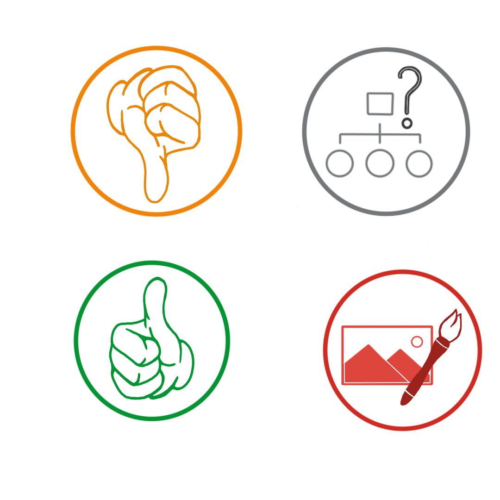

# DECISION LOG 
## Decision Details 
- Date: Oct 4th, 2023
- Decision Maker: Vidhu, All members
  
## Background 
With the proliferation of digital media, discerning the authenticity of images has become a significant challenge. We recognised the need for a visual cue system as part of our commitment to enhance image transparency and credibility. This would allow users to quickly identify the trustworthiness and source of images, ensuring a reliable user experience.

## Decision Options 

1. Use text labels for credibility indications.
2. Use a colour-coded system without symbols.
3. Design a symbol set combined with colour-coding for clearer visual indications.

## Decision Rationale 
Option Chosen: Design a symbol set combined with color-coding.

Reasons for Decision:

1. Immediate Recognition: Symbols are universally recognized and can be understood faster than reading text labels.
2. Color Association: The use of specific colours (green, red, orange, and grey) provides an intuitive understanding of the image's credibility status.
3. Universal Appeal: Symbols break language barriers, making the platform user-friendly for a global audience.
4. Simplicity & Clarity: Using straightforward symbols avoids ambiguity and ensures the user gets a clear message about the image's authenticity.
Alternatives Considered:

Using only text labels was deemed less effective due to the additional cognitive load required to read and interpret.

A colour-coded system without symbols might lack clarity and could lead to misinterpretations based on individual colour perceptions.

## Decision Outcome 
We anticipate improved user trust in our platform by adopting a combined approach of symbols and colour-coding for our credibility signals. This decision prioritizes user experience by providing a clear, quick, and effective way to discern the authenticity and source of images.

## Expected Impact

We foresee a positive user reception, with quicker decision-making regarding the trustworthiness of images. The credibility signals should enhance overall user engagement and trust in the platform, leading to increased usage and community contributions.

Credibility Symbols Version 1.0.0 (credit to Vidhu)
